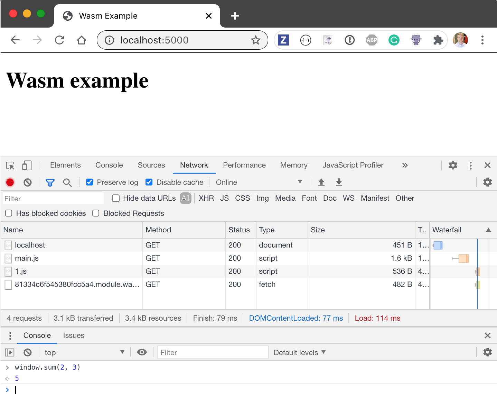

# cypress-example-wasm-ts

## Prerequisites
1. Install [rust](https://www.rust-lang.org/tools/install)
2. Install [wasm-pack](https://rustwasm.github.io/wasm-pack/installer/)
3. Ensure you have Node v12.18 or higher

## Building and Preparing

1. Run `make build`
2. Run to install dev dependencies `npm install`
3. Build the Webpack bundle from [src/index.js](src/index.js) into [dist](dist) folder with `npm run build`. Note that our case is so simple we don't even need a webpack config file
4. Start local server to serve [dist/index.html](dist/index.html) with `npm start`
5. Open `localhost:5000` to see the Wasm file opened, and you can call `window.sum` to confirm WASM working



## Testing

We are not loading the WASM bundle directly from the spec file, instead we load the `localhost:5000` that exposes the loaded WASM module from [src/index.js](src/index.js).

```js
// src/index.js
// thus we need to use dynamic import and then use the imported module
// we can set a single property on the window
import('../internal/wasm_pack_ts_cypress').then(({ sum }) => {
  // expose the "sum" import on the window object
  // to be able to access it from the Cypress tests
  window.sum = sum
})
```

From the test [src/sum.spec.ts](src/sum.spec.ts) we load the page using [cy.visit](https://on.cypress.io/visit) and then use [cy.window](https://on.cypress.io/window) to access the app's `window` object where the app's dynamic import will set `window.sum`

```js
describe('Wasm', () => {
  it('sums', () => {
    cy.visit('/')
    // automatically retry checking "window.sum" until
    // it is set and is a function
    cy.window()
      .its('sum')
      .should('be.a', 'function')
      .then((sum) => {
        // now let's test the sum
        expect(sum(2, 3)).to.equal(5)
      })
  })
})
```

To start the server and open Cypress execute `npm run dev`


